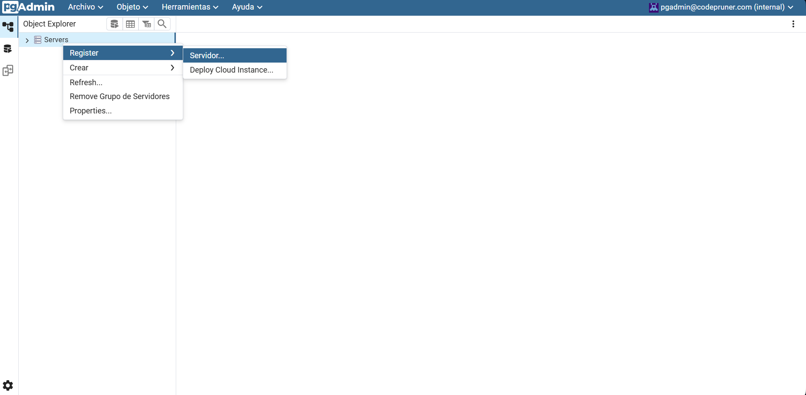
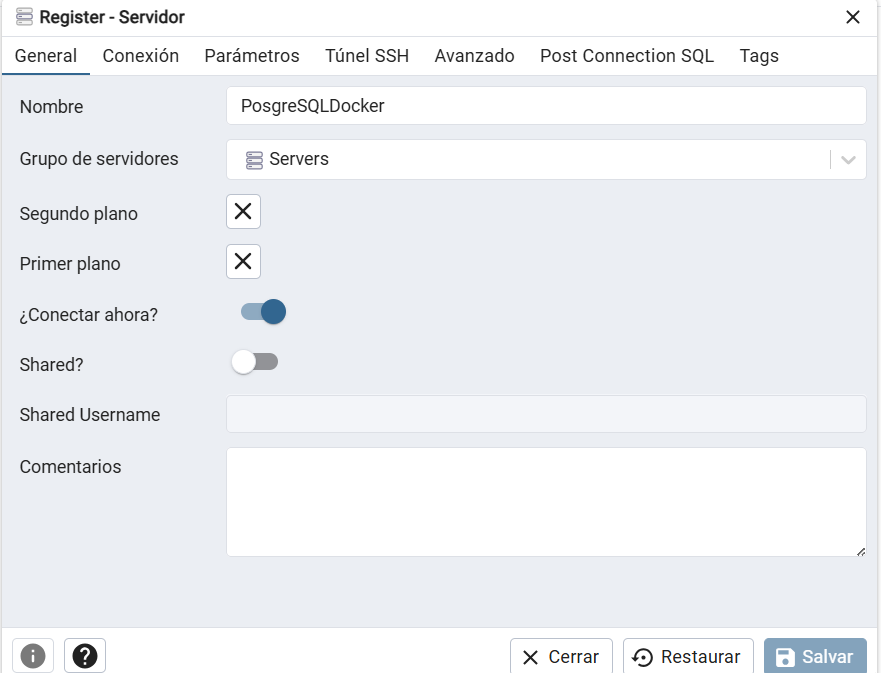
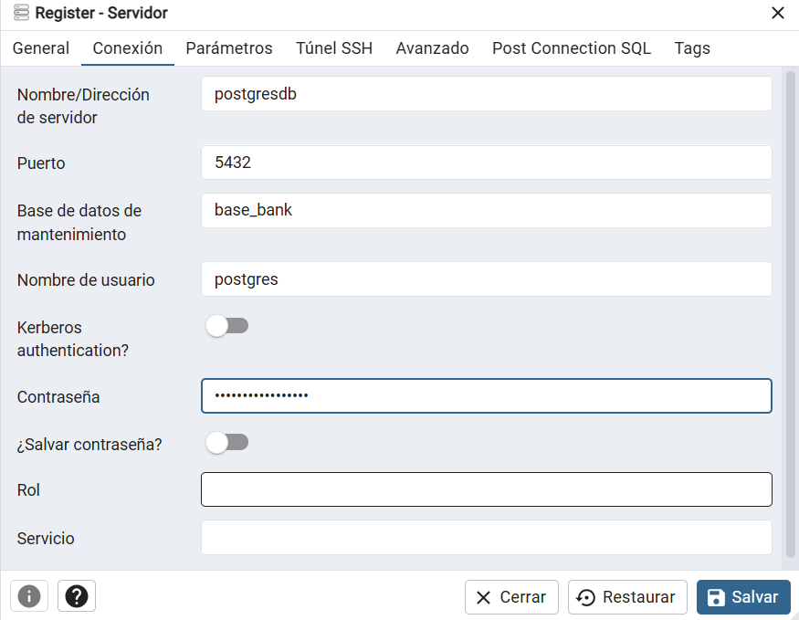
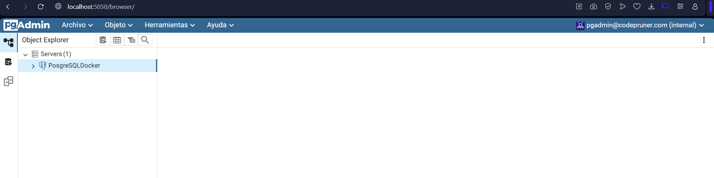
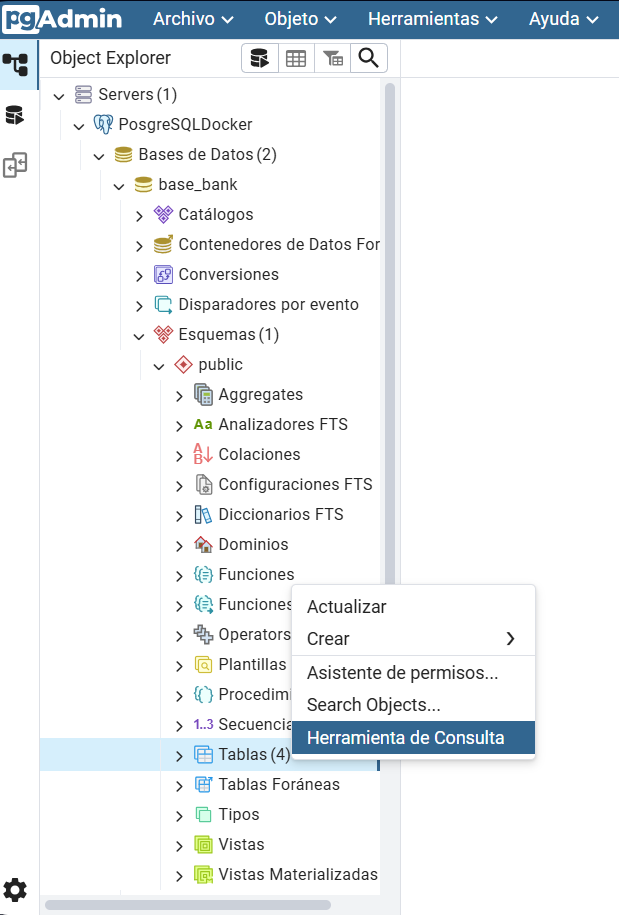
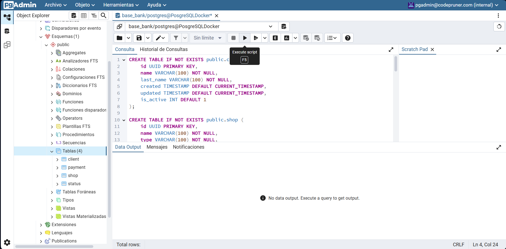

# servidor bd

**1. Abrir siguiente link**
- [PgAdmin](http://localhost:5050/login?next=/)

**2. Ingresar credenciales login**

- **Email:** pgadmin@codepruner.com
- **Contraseña:** pgadminP@ssw0rd!

**3. Registrar Servidor.**

Dar clic derecho en
Servers -> Register -> Servidor 

**4. Datos Servidor**

Pestaña General agregar nombre para el servidor en este caso : **PosgreSQLDocker**.

Despues, Dar clic pestaña Conexión. Agregar la siguiente información

- **Nombre/Dirección de servidor:** postgres_db
- **Puerto:** 5432
- **Base de datos:** base_bank
- **Nombre de usuario:** postgres
- **Contraseña:** postgres_password

Por ultimo, dar clic en Salvar.

Una vez realizado los pasos anteriores nos aparece nuestro servidor.

**4. Ejecutar script SQL**

Dar clic > PosgreSQLDocker > Base de Datos > base_bank > Esquemas > public. 

Ahora dar un clic derecho en tablas y elegir la opción "Herramienta de consulta"

Despues, abrir el siguiente link y copiar el contenido del script
- [Scriptdb](https://github.com/king-beard/payment-api/blob/main/base_bank.sql)

A continuación, pegamos el contenido del script y ejecutamos el script. Dar clic en el simbolo de play o F5.

Listo con esto finalizamos configuración del servidor db